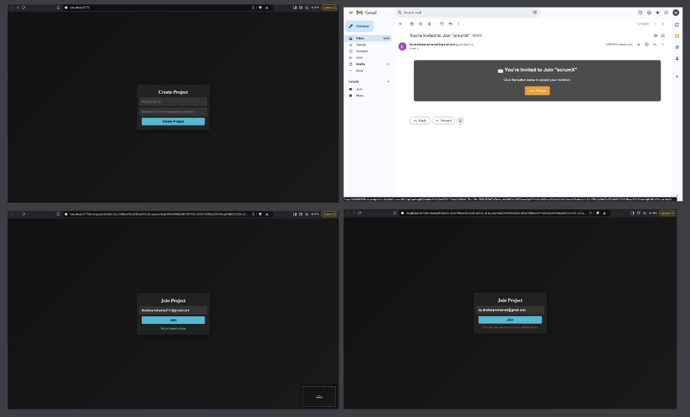

```md
# Project Invitation by Gmail

A remote collaboration tool that allows users to create projects, invite team members via Gmail, and join projects using unique invite links.

## Features

- ✅ Create and manage projects  
- 📩 Invite team members via Gmail  
- 🔗 Join projects using an invite link  
- 🔒 Secure and user-friendly interface  

## Tech Stack

- **Frontend:** React, React Router  
- **Backend:** Node.js, Express.js, MongoDB  
- **Authentication:** JWT (JSON Web Token)  
- **Email Service:** SendGrid  

## Installation & Setup

### Prerequisites
- Node.js installed
- MongoDB running locally or on a cloud service (e.g., MongoDB Atlas)
- SendGrid API key for sending emails

### Clone the Repository
```sh
git clone https://github.com/yourusername/project-invitation.git
cd project-invitation
```

### Install Dependencies

#### Backend
```sh
cd server
npm install
```

#### Frontend
```sh
cd client
npm install
```

### Environment Variables

Create a `.env` file in the **server** directory and add:

```env
PORT=3300
MONGO_URI=your_mongodb_connection_string
SENDGRID_API_KEY=your_sendgrid_api_key
JWT_SECRET=your_jwt_secret_key
CLIENT_URL=http://localhost:5173
```

### Run the Project

#### Start Backend
```sh
cd server
npm start
```

#### Start Frontend
```sh
cd client
npm run dev
```

## API Endpoints

| Method | Endpoint | Description |
|--------|---------|-------------|
| POST   | `/api/projects/create` | Create a new project |
| POST   | `/api/projects/join/:inviteToken` | Join a project via invite link |
| GET    | `/api/projects/:id` | Get project details |

## How It Works

1. **Create a Project** – Users enter a project name and invite members via Gmail.  
2. **Send Invitations** – An email with an invite link is sent via SendGrid.  
3. **Join a Project** – Users click the invite link, enter their email, and join the project.  

## Author

👤 **Shafeeq Mohamed**  
📧 [Email Me](mailto:shafeeqmohamed111@gmail.com)
🔗 [GitHub Profile](https://github.com/shafeeq777444)
🔗 [LinkedIn](https://www.linkedin.com/in/mohamed-shafeeq-570502231/)

## License

This project is licensed under the [MIT License](LICENSE).

---
